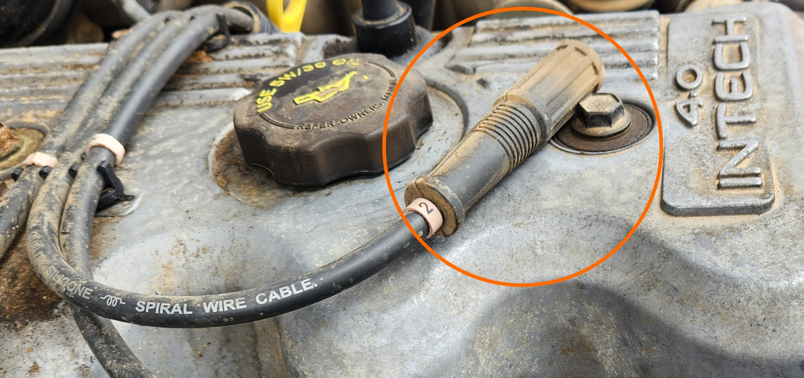
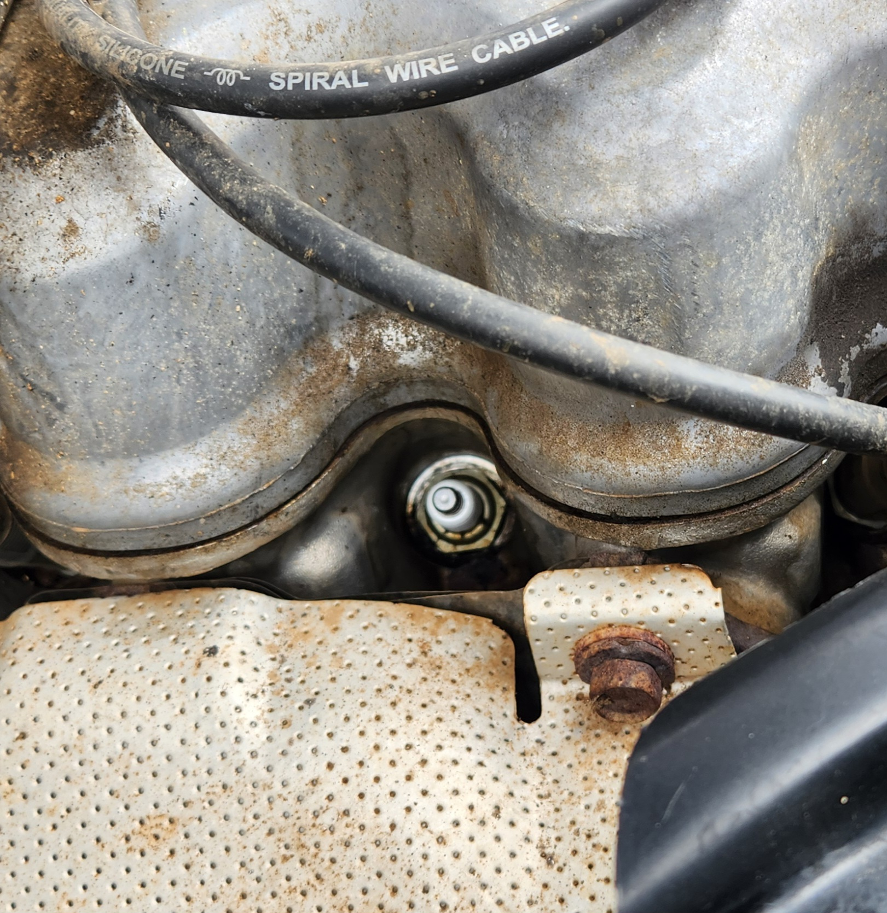
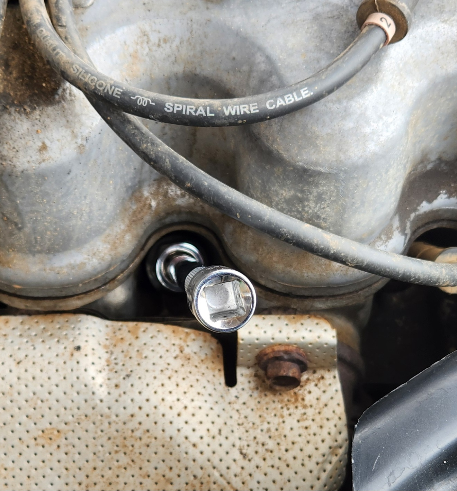
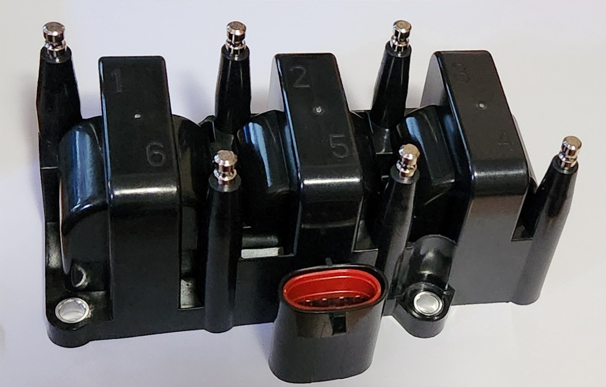

<link rel="stylesheet" type="text/css" href="../../Common/overrides.css">

# Ignition Systems

## Sparkplugs
While the sparkplug manufacturer code vary according to the manufacturer, the following is *usually* common between them:

| Specification | Value |
| --- | --- |
| Thread | M14x1.25 |
| Hex Size | 21mm |
| Reach | 18-21mm |
| Resisted | Yes |
| Gap | 1-1.1mm |

### Replacement

if you need to replace the sparkplugs, follow the steps below:

1. locate and remove the ignition coil plugs from the sparkplugs. A tool can be used if needed, however it is possible to pull it out by hand, **as long as you pull from the rubber plug itself, and not the attached ignition cable**

    

    > Photo of the sparkplug lead, already removed. make sure to grab by the circled area so that the cable doesn't break apart

1. clean the area around the sparkplug to ensure onn debris falls into the sparkplug hole

    

    > Photo of the sparkplug area, post cleaning

1. place a sparkplug socket over the sparkplug along with a short extension bar, and undo using a socket driver

1. replace the sparkplug as required and **hand tighten** using the extension bar and sparkplug socket.

    > NOTE: hand tightening helps to not crossthread the sparkplug hole

    

1. drive the sparkplug the rest of the way in using the driver

    > NOTE: a good rule of thumb is to tighten reasonably loosely using the driver, then snug it down about 1/8 of a rotation clockwise

1. plug the ignition lead back into the sparkplug, ensuring that the lead is fully seated on the plug
1. done

> NOTE: In a pinch, the sparkplugs can be *carefully* removed using a 21mm deep socket, thanks to the location of the sparkplugs not being recessed too far into the top of engine. While this is the same size as the wheel nuts for the model, the included wheel spanner **will not** fit the spark plug recesses. If you wish to overcome this, simply replace the wheel spanner with a 1/2" drive breaker bar, a 21mm deep socket, and a 1/2" extension bar.

## Ignition coil pack
The AU Falcon is the last Ford Falcon manufactured that used a ignition coil pack rather than the newer individual coil on plug design. This comes with the drawback of having to replace the entire unit when one part of the coil pack fails, however this also comes with the benefit that (generally) replacing the coil pack on an AU Falcon is approximately the same price as replacing 1-2 ignition coils on a later model Falcon*

* as of time of writing in 2024

### Variations
There is no one universal coil pack for the entire line of AU Falcons, due to changes made after the S1 Falcons and different engine configurations (I6/I6 VCT/V8)

> NOTE: These changes in coil packs also affect the sparkplug leads required

#### S1 - I6
The base engine in the first AU Falcons shared a ignition coil pack with the previous model, the EL Falcon. These are identifiable by the oval shaped electrical connector, and exposed steel ends on each cylinder connection.

> Photo of aftermarket ignition coil pack

#### S2/3 - I6
The base engine for the later models of falcons had a different coil pack with different connections, and can be identified by the more square shaped electrical connector, and recessed sparkplug lead connectors. This was also the ignition coil pack used for the VCT engines

> Photo taken from Auto Parts Supply product page

#### V8 Models
The V8 Models use 2 ignition coil packs, one for each 4 cylinder bank of the V8 Windsor model engine.

> Photo taken from A1 Auto Parts product page

### Installation

> NOTE: following section does not include V8 model installation, due to lack of resources. Information gathered suggests that the coil packs are easily visible from the top of the engine however.

The Ignition coil pack in the AU Falcon Intech models is situated somewhat inconveniently below the intake manifold, however with the right tools, you can remove the coil pack without doing anything to the intake manifold, and without getting under the car, however in order to do this, a long socket extension is highly recommended, as this makes things far easier.

1. Remove the Airbox and all plastic tubing all the way to the Throttle body
    <!--TODO add a photo-->
1. By reaching around the intake manifold through the gap made by removing the airbox, remove the ignition leads
    <!--TODO add a photo-->
1. depending on your series and whether you have a long extension bar:
    1. If you have a Series 1 and a extension bar:
        - remove the rear most bolt by feeding the extension bar between cylinders X & X on the intake manifold
        - remove the middle-rear bolt by feeding the extension bar between cylinders X & X on the intake manifold
        - remove the middle front bolt by feeding the extension bar between cylinders X & X on the intake manifold
        - remove the front most bolt by feeding the extension bar between cylinders X & X on the intake manifold
    1. If you have a Series 2-3 and an extension bar:
        - remove the rear bolt by feeding the extension bar between cylinders 5 & 6 on the intake manifold
        - remove the 2 front bolts by feeding the extension bar between cylinders 3 & 4 on the intake manifold
    1. If you have any series AU and NO extension bar, reach around the intake manifold with the socket in hand and undo all bolts
    > NOTE: this will be especially difficult with the bolts on the driver side of the coil pack
    <!--todo add bolt sizes and intake cylinders for S1-->
1. replace the ignition coil pack, and perform the reverse of the previous step
1. done