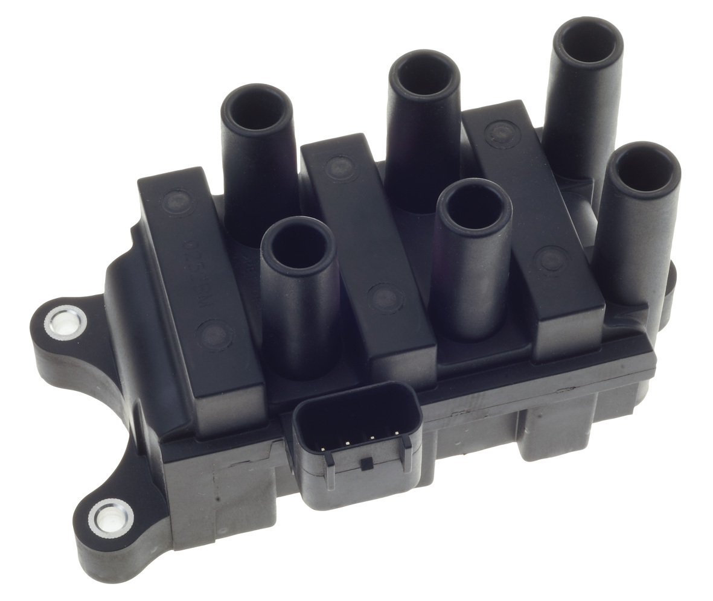
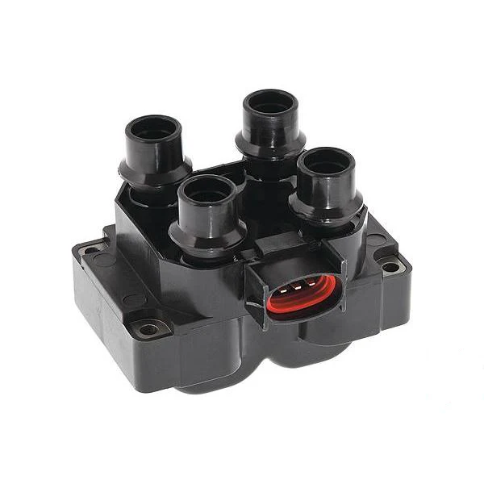

<link rel="stylesheet" type="text/css" href="../../Common/overrides.css">

# Ignition Systems

## Spark plugs
While the spark plug manufacturer code vary according to the manufacturer, the following is *usually* common between them:

| Specification | Value |
| --- | --- |
| Thread | M14x1.25 |
| Hex Size | 21mm |
| Reach | 18-21mm |
| Resisted | Yes |

> NOTE: In a pinch, the sparkplugs can be *carefully* removed using a 21mm deep socket, thanks to the location of the spark plugs not being recessed into the top of engine.

<!--TODO test removal using wheel iron and report-->

## Ignition coil pack
The AU Falcon is the last Ford Falcon produced that used a ignition coil pack rather than the newer individual coil on plug design. This comes with the drawback of having to replace the entire unit when one part of the coil pack fails, however this also comes with the benefit that (generally) replacing the coil pack on an AU Falcon is approximately the same price as replacing 1-2 ignition coils on a later model Falcon*

* as of time of writing in 2024

### Variations
There is no one universal coil pack for the entire line of AU Falcons, due to changes made after the S1 Falcons and different engine configurations (I6/I6 VCT/V8)

> NOTE: These changes in coil packs also affect the spark plug leads required

#### S1 - I6
The base engine in the first AU Falcons shared a ignition coil pack with the previous model, the EL Falcon. These are identifiable by the oval shaped electrical connector, and exposed steel ends on each cylinder connection.

> Photo taken from T.I Performance product page

#### S2/3 - I6
The base engine for the later models of falcons had a different coil pack with different connections, and can be identified by the more square shaped electrical connector, and recessed spark plug lead connectors. This was also the ignition coil pack used for the VCT engines

> Photo taken from Auto Parts Supply product page

#### V8 Models
The V8 Models use 2 ignition coil packs, one for each 4 cylinder bank of the V8 Windsor model engine.

> Photo taken from A1 Auto Parts product page

### Installation

> NOTE: following section does not include V8 model installation, due to lack of resources. Information gathered suggests that the coil packs are easily visible from the top of the engine however.

The Ignition coil pack in the AU Falcon Intech models is situated somewhat inconveniently below the intake manifold, however with the right tools, you can remove the coil pack without doing anything to the intake manifold, and without getting under the car, however in order to do this, a long socket extension is highly recommended, as this makes things far easier.

1. Remove the Airbox and all plastic tubing all the way to the Throttle body
    <!--TODO add a photo-->
1. By reaching around the intake manifold through the gap made by removing the airbox, remove the ignition leads
    <!--TODO add a photo-->
1. depending on if you have a long socket extension bar:
    - Feed the socket extension bar through the gap between cylinder 5 & 6 on the intake manifold to undo the rear bolt. Feed the socket extension through the gap between cylinders 3 & 4 to reach the front bolts.
    - Reach around the intake manifold with a socket and short extension and undo all 3 bolts
    <!--TODO add pics, bolt size-->
1. replace the ignition coil pack, and perform the reverse of the previous step
1. done