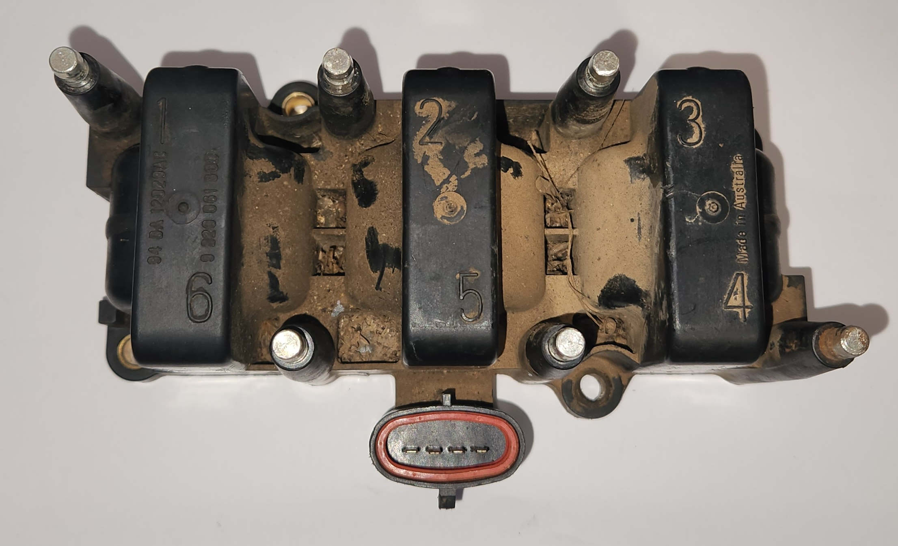

# Ignition Coil Pack
The AU Falcon is the last Ford Falcon manufactured that used a ignition coil pack rather than the newer individual coil on plug design. This comes with the drawback of having to replace the entire unit when one part of the coil pack fails, however this also comes with the benefit that (generally) replacing the coil pack on an AU Falcon is approximately the same price as replacing 1-2 ignition coils on a later model Falcon*

* as of time of writing in 2024

## Variations
There is no one universal coil pack for the entire line of AU Falcons, due to changes made after the S1 Falcons and different engine configurations (I6/I6 VCT/V8)

> These changes in coil packs also affect the sparkplug leads required
{: .block-note}

### S1 - I6
The base engine in the first AU Falcons shared a ignition coil pack with the previous model, the EL Falcon. These are identifiable by the oval shaped electrical connector, and exposed steel ends on each cylinder connection.

> Photo of aftermarket ignition coil pack

### S2/3 - I6
The base engine for the later models of falcons had a different coil pack with different connections, and can be identified by the more square shaped electrical connector, and recessed sparkplug lead connectors. This was also the ignition coil pack used for the VCT engines

> Photo taken from Auto Parts Supply product page

### V8 Models
The V8 Models use 2 ignition coil packs, one for each 4 cylinder bank of the V8 Windsor model engine.

> Photo taken from A1 Auto Parts product page

## Replacement

> following section does not include V8 model installation, due to lack of resources. Information gathered suggests that the coil packs are easily visible from the top of the engine however.
{: .block-note}

The Ignition coil pack in the AU Falcon Intech models is situated somewhat inconveniently below the intake manifold, however with the right tools, you can remove the coil pack without doing anything to the intake manifold, and without getting under the car, however in order to do this, a long socket extension and a telescopic magnetic stick or similar implement is highly recommended.

The recommended method for removing these coil packs is to either completely remove the intake manifold or to lift the car and blind unscrew the bolts from underneath. The following instructions assume you don't wish to do either and are willing to carefully manoeuver the coil pack out and back into the area under the intake manifold.

> the ignition coil bolts are all 8mm
{: .block-note}

1. Remove the Airbox and all plastic tubing all the way to the Throttle body, this will require the removal of 3 10mm bolts on the airbox itself, and 3 10mm bolts on the plastic piping from the airbox to the throttle body
    
    
    
    

    > Photos of the bolt and screw locations to remove the entire airbox

    > if you're confident, the airbox may be able to be removed *carefully* without removing the snorkel, however due to the 2 screws of effort, it isn't advised
    {: .block-note}

    > this is important to do now simply to provide more room for removal later on
    {: .block-note}

1. Unplug the Air Conditioner Pressure switch

    

    > photo of the Air Conditioner pressure switch, post unplugging.

1. By reaching around the intake manifold through the gap made by removing the airbox, remove the ignition leads and electrical plug
    
    

    > photo of the ignition coil pack plug on a S1 Falcon, post removal

1. depending on your series and whether you have a long extension bar:
    1. If you have a Series 1 and a extension bar and a magnet stick:
        - remove the rear most (driver side rear) bolt by feeding the extension bar between cylinders 4 & 5 on the intake manifold
        - remove the middle-rear (passenger side rear) bolt by feeding a small socket wrench (1/4" drive recommended) and a short extension under cylinder 5

            > this can be the trickiest bolt to get out as the AC lines run directly next to this bolt
            {: .block-note}

        - remove the middle front (driver side front) bolt by feeding the extension bar between cylinders 3 & 4 on the intake manifold
        - remove the front most (passenger side front) bolt by feeding a small socket wrench (1/4" drive recommended) and a short extension under cylinder 3
    1. If you have a Series 2-3 and an extension bar:
        - remove the rear bolt by feeding the extension bar between cylinders 5 & 6 on the intake manifold
        - remove the 2 front bolts by feeding the extension bar between cylinders 3 & 4 on the intake manifold
    1. If you have any series AU and NO extension bar or magnetic stick, reach around the intake manifold with the socket in hand and undo all bolts
    
    > this will be especially difficult with the bolts on the driver side of the coil pack
    {: .block-note}

    > you can use the front of the engine to reach in underneath the thermostat housing to enable both hands to be in the area of the ignition coil pack, assuming you have smaller hands
    {: .block-note}

    > lack of images for this section due to variations and tight working area
    {: .block-note}

1. *Carefully* remove the ignition coil pack by rotating and twisting the pack to manoeuver it out from under the ignition coil pack. This will take a significant amount of patience, below are some dot points on removal:
    - rotate pack to have wire connectors facing down and plug on driver side
    - rotate to get pack ends 1-3 over AC lines
    - twist while rotating to fit plastic housing under 2 banks of intake manifold and free of AC lines
    - rotate coil pack to have all plug connectors facing the driver side of vehicle, and pull gently past vacuum line and AC pressure switch
1. (optional) test the [Ignition Coil Pack Resistances](#ignition-coil-resistances)
1. replace the ignition coil pack by performing the reverse of the previous step
1. done

## Ignition Coil Resistances

> lack of information for V8 models due to project only involving I6
{: .block-note}

Ignition coils can be tested for resistance based on **Primary** and **Secondary** resistances, explained below.

All following instructions assume you have the ignition coil pack horizontally in front of you, with the plug closest to you and the following pin/pole information:

**Electrical plug pinout**

<!--coded as HTML table because markdown hates single line tables-->
<table>
    <thead>
        <th><code>1</code></th>
        <th><code>2</code></th>
        <th><code>3</code></th>
        <th><code>4</code></th>
    </thead>
</table>

**Spark plug lead pole layout**

| `1` | `2` | `3` |
| --- | --- | --- |
| **`6`** | **`5`** | **`4`** |

> photo of how the ignition coil should be laid out in front of you (mind the grime). This is the same as the rectangular plugged S2-3 Models

### Primary resistance

This resistance is from the first part of the ignition coil pack wiring, which takes a high current from the battery and feeds it into the secondary coil. These resistances can be measured by doing the following:

> all resistances should be approx. 0.6Ω
{: .block-note}

1. check the resistance between pins 4 and 1
1. check the resistance between pins 4 and 2
1. check the resistance between pins 4 and 3

### Secondary resistance

This resistance is for the second part of the ignition coil pack, which converts the high current from the battery into a high *voltage* signal for the spark plug leads. These resistances can be measured by doing the following:

> all resistances should be 9-9.5KΩ, 9.2KΩ ideal
{: .block-note}

1. check the resistance between the poles for cylinder 1 and 6
1. check the resistance between the poles for cylinder 2 and 5
1. check the resistance between the poles for cylinder 3 and 4

## Additional Notes

The ignition coil pack fires 2 cylinders at the same time, 1 & 6, 2 & 5 and 3 & 4. This information can be helpful for diagnosing single cylinder misfires.