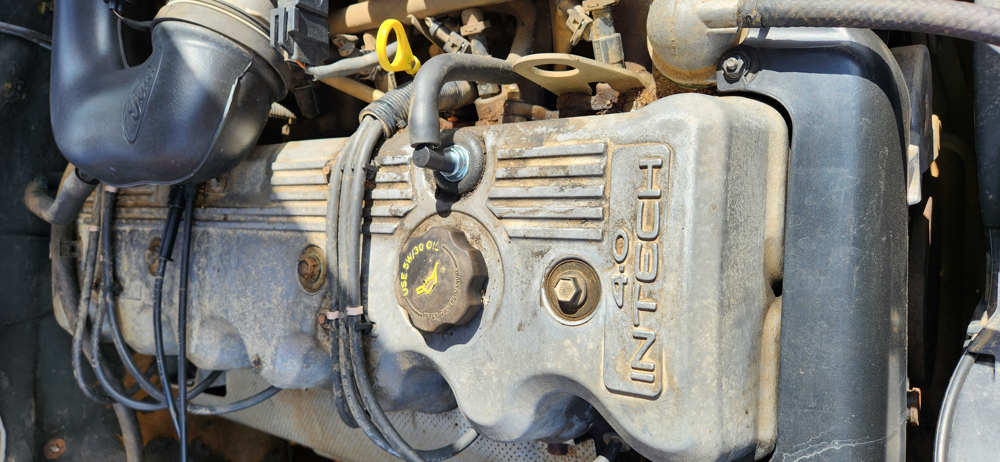

<link rel="stylesheet" type="text/css" href="../../Common/overrides.css">

# PCV

## Purpose

A brief description on the PCV can be found below (dot-point form for brevity, but in here as is it a lesser known part)

* PCV stands for Purge Control Valve
* PCV sends excess unburned gas in the crankcase back to the block
* major purpose appears to be emissions control and efficiency (giving unburned gases another chance to combust in the motor)
* bad PCVs cause:
    * rough start
    * rough idle
    * uses oil
* The PCV is located right next to the oil cap on the top of the engine

## Replacement

> NOTE: the general consensus is that it is better to replace the PCV with an aftermarket steel based PCV, for reliability and longevity more than anything else

if you need to replace the PCV, follow the below steps:
1. gently twist and pull the PCV from the top of the rocker cover on the engine
    
    

    > Photo of the PCV post removal. Now is a good time to make sure the rubber gasket is in serviceable condition and also replace if required

    > NOTE: ensure that nothing is left behind in the engine from the old PCV, as this can cause damage if it breaks through the filter at the base of the mounting hole
    
1. remove the breather hose from the side of PCV assembly

    

    > Photo of PCV post-installation

1. reverse previous steps with new unit to install
1. done