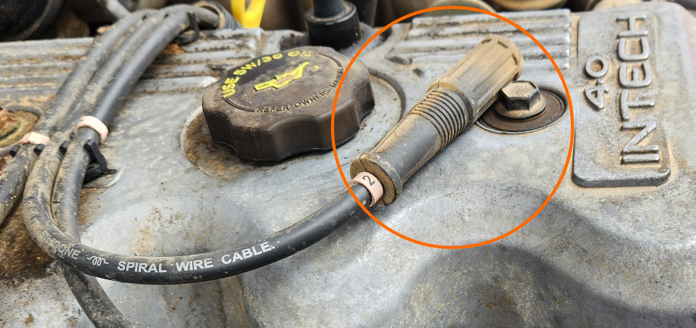
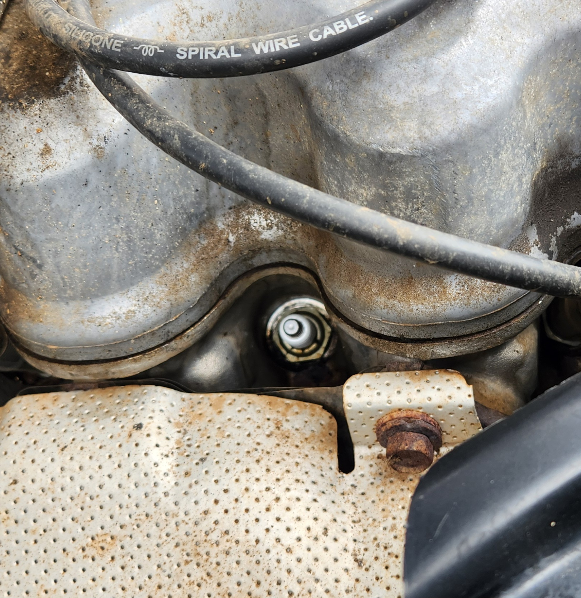
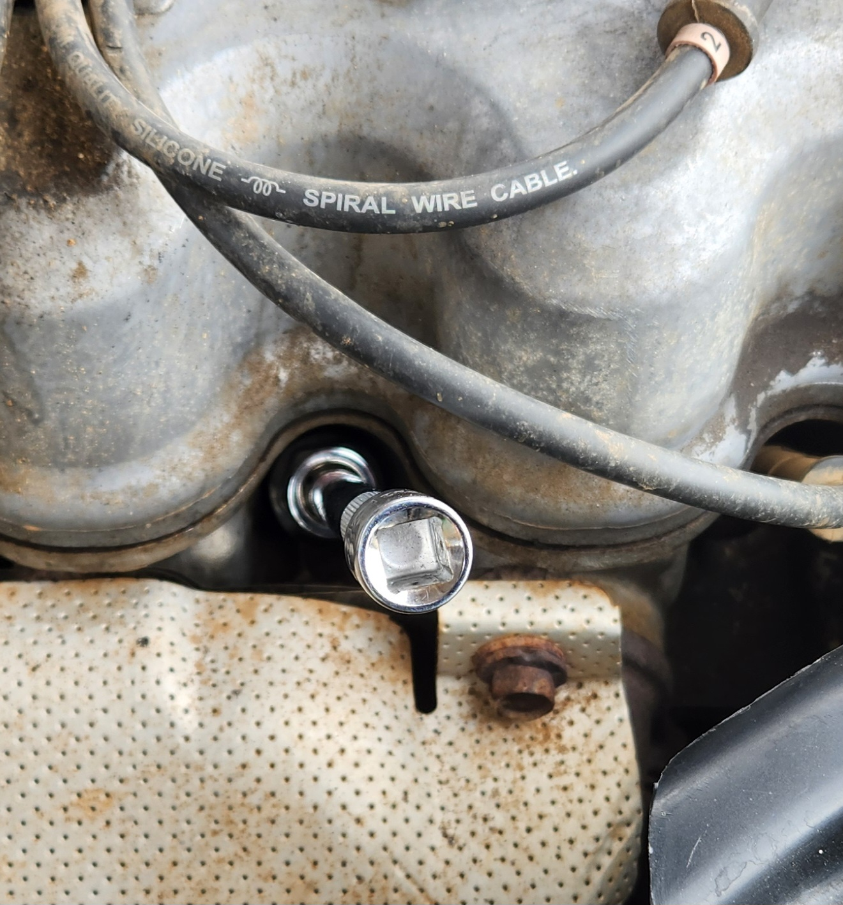

# Sparkplugs
While the sparkplug manufacturer code vary according to the manufacturer, the following is *usually* common between them:

| Specification | Value |
| --- | --- |
| Thread | M14x1.25 |
| Hex Size | 21mm |
| Reach | 18-21mm |
| Resisted | Yes |
| Gap | 1-1.1mm |

## Replacement

if you need to replace the sparkplugs, follow the steps below:

1. locate and remove the ignition coil plugs from the sparkplugs. A tool can be used if needed, however it is possible to pull it out by hand, **as long as you pull from the rubber plug itself, and not the attached ignition cable**

    

    > Photo of the sparkplug lead, already removed. make sure to grab by the circled area so that the cable doesn't break apart

1. clean the area around the sparkplug to ensure onn debris falls into the sparkplug hole

    

    > Photo of the sparkplug area, post cleaning

1. place a sparkplug socket over the sparkplug along with a short extension bar, and undo using a socket driver

1. replace the sparkplug as required and **hand tighten** using the extension bar and sparkplug socket.

    > NOTE: hand tightening helps to not crossthread the sparkplug hole

    

1. drive the sparkplug the rest of the way in using the driver

    > NOTE: a good rule of thumb is to tighten reasonably loosely using the driver, then snug it down about 1/8 of a rotation clockwise

1. plug the ignition lead back into the sparkplug, ensuring that the lead is fully seated on the plug
1. done

> NOTE: In a pinch, the sparkplugs can be *carefully* removed using a 21mm deep socket, thanks to the location of the sparkplugs not being recessed too far into the top of engine. While this is the same size as the wheel nuts for the model, the included wheel spanner **will not** fit the spark plug recesses. If you wish to overcome this, simply replace the wheel spanner with a 1/2" drive breaker bar, a 21mm deep socket, and a 1/2" extension bar.