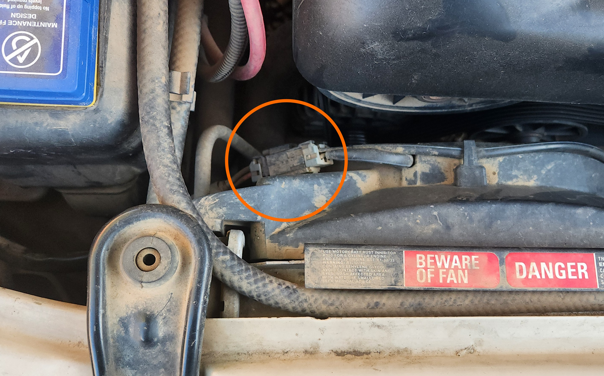
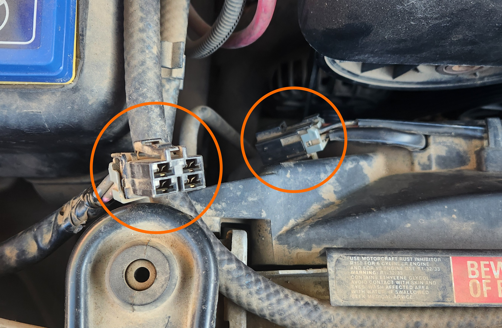
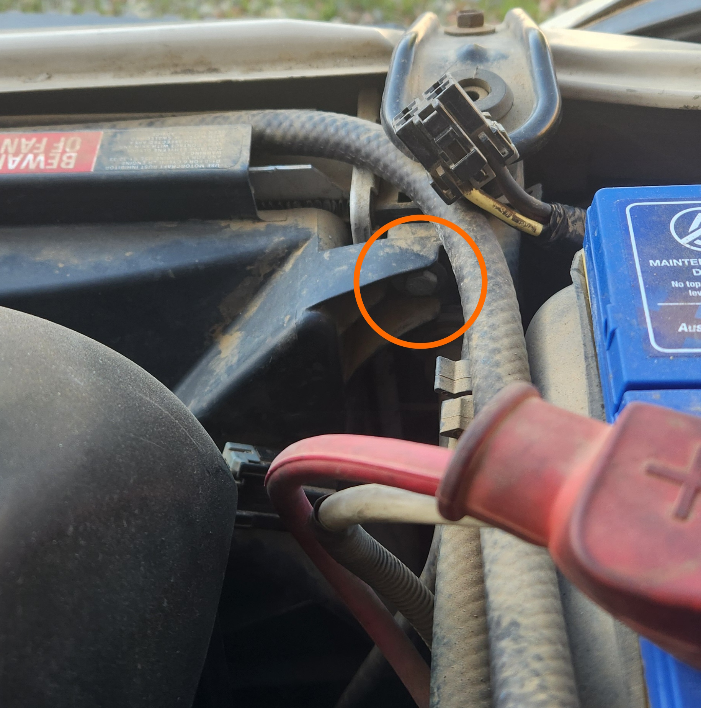
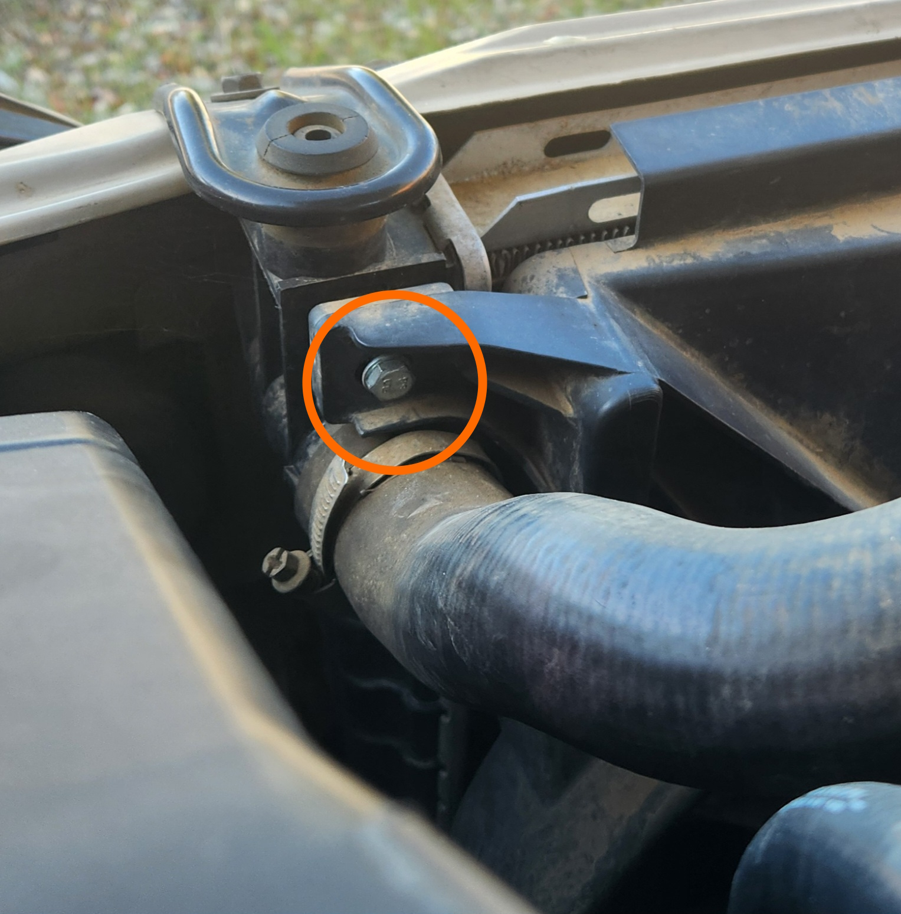
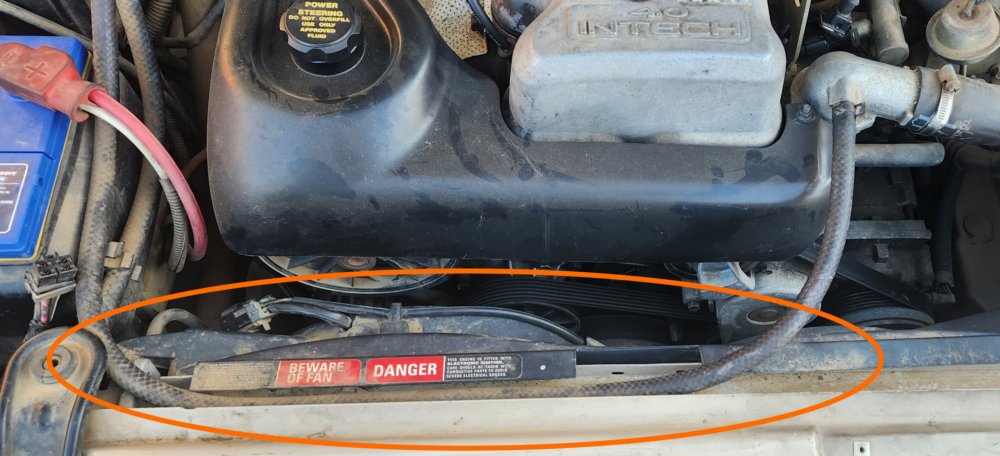
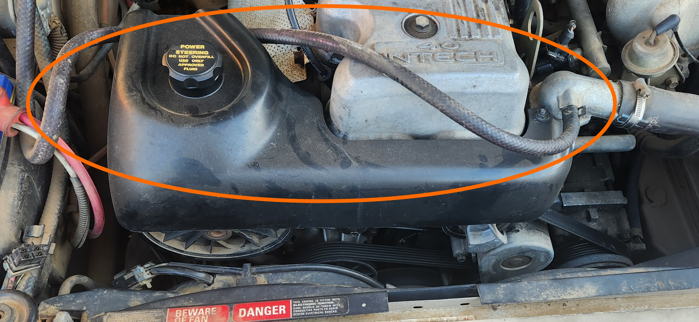

# Thermo Fan

The thermo fans are the fans located directly behind the radiator, which can be easily removed for access to components towards the front of the engine bay. Removal steps are below:

1. Remove the 2 phillips head screws holding the intake snorkel to the airbox, and remove by pulling the snorkel from the airbox.

    
    > Picture of snorkel screw locations

1. Unplug the thermo fan electrical connector by pushing the table on the loom end connector down and pulling the 2 plug housings apart.

    
    
    > Pictures of thermo fan electrical connector, before and after removal respectively

1. Unbolt the 2 10mm bolts holding the top of the thermo fan assembly to the rear of the radiator

    
    
    > Pictures of the thermo fan housing bolt locations, for the driver side and passenger sides respectively

1. Adjust the thermostat housing coolant return line away from the working area

    
    
    > Pictures of the Thermostat coolant return line, before and after moving respectively

1. Remove the thermo fan assembly by pulling the assembly up and out

    > Be careful of the passenger side of the thermo fan assembly, as it will foul on the thermostat housing outlet pipe if pulled directly up. Some rotation will be required
    {: .block-note}

1. to reinstall, repeat all steps in reverse
1. done