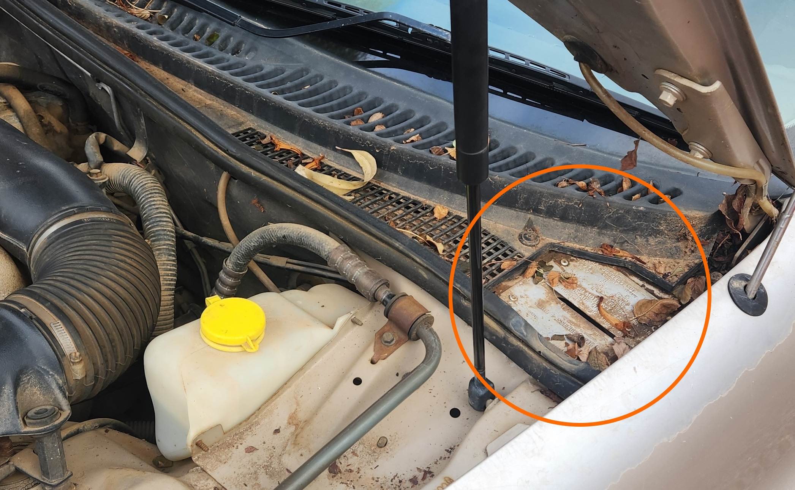

# Reading Vehicle Identification Plate (Build Plate) Codes

## Location

You can find the Build plate near the [VIN Plate](../VIN/VIN.md), on the passenger side rear of the inside of the engine bay.

> The location of the Vehicle Identification Plate

## Codes and What They Mean

### VIN

The Vehicle Indentification Number, or VIN, is printed on the build plate as redundant information. Further information can be found on the [VIN Plate Page](../VIN/VIN.md)

### SIDO Number

The Single Item Dealer Order number, or SIDO, is simply a unique build identifier for the specific vehicle. It holds very little relevance past date of original sale

### Model

The Model number is a more specific identifier of the trim model that the vehicle was built with. Refer to the table below for what each number corresponds to:

| Number | Model | Body |
| --- | ---| --- |
| `18932` | Fairmont | Sedan |
| `18933` | Forte | Sedan |
| `18935` | XR (6 or 8) | Sedan |
| `18938` | Fairmont GHIA | Sedan |
| `18946` | LTD (Fairlane) | Sedan |
| `18949` | Fairlane GHIA | Sedan |
| `18962` | Fairmont | Wagon |
| `18963` | Forte | Wagon |
| `18964` | Futura | Wagon |
| `19934` | Futura | Sedan |
| `45913` | XL | Ute |
| `45914` | XLS | Ute |
| `45973` | XL Supercab | Ute |
| `45974` | XLS Supercab | Ute |
| `45975` | XR (6 or 8) | Ute |

### Engine

The engine code identifies the specific factory motor that was installed. Refer to the table below for what each code corresponds to:

| Code | Engine | Identifiable Traits | Notes |
| --- | --- | --- | --- |
| `H` | I6 | Silver rocker cover | Base Model Engine |
| `S` | I6 LPG | Green rocker cover | Gas Engine. Standard in Taxi Models |
| `X` | I6 HP | Red rocker cover | High Horsepower I6 Engine. Standard in XR6 Models |
| `Y` | I6 VCT | Red rocker cover with visible VCT solenoid fitted to front and `VCT` embossed on top of rocker cover | Variable Cam Timing Engine |
| `Z` | V8 (5L) | Only standard V8 | Standard in XR8 models |

> Some engines may be harder to identify due to changed parts since assembly. This is only a guide to what the car had from the factory, not what has been replaced or painted since.
{: .block-note}

> Any model with Tickford additions, in particular the T*50 models, should have an additional Tickford options plate. No information on this plate is known due to project not including Tickford modified model.
{: .block-note}

### Transmission

The transmission code identifies the type and location of the transmission. Refer to the table below for what each code corresponds to:

| Code | Type | Location |
| --- | --- | --- |
| `H` | Automatic | Column |
| `K` | Manual | Floor |
| `W` | Automatic | Floor |

### RR AX and FR AX

> Information on these codes are sparse but should refer to the Rear and Front Axles. Their purpose is unknown due to all accessible cars for Project not including values
{: .block-note}

### Trim

The trim code refers to the interior color and accents used throughout the vehicle. Refer to the list below for what each code corresponds to:

> While these trim code will *narrow down* the exact trim inside your vehicle, it will not *uniquely identify* it, e.g. a Series 1 Forte and a Series 3 Fairmont share the same trim code `G1`, however the patterns in the cloth seats are different
{: .block-note}

> Information pulled from multiple sources. As such this may be incomplete. Every effort has been made to ensure accuracy
{: .block-note}

#### A* - Aubergine

| Code | Material | Restrictions |
| --- | --- | --- |
| `A3` | Leather | TS50/TE50/TL50 |

#### B* - Charcoal

| Code | Material | Restrictions |
| --- | --- | --- |
| `B1` | Cloth | |
| `B2` | Cloth | XR6/XR8 |
| `B3` | Leather | |
| `B5` | Leather | Promotional* see note below |
| `B7` | Leather | Fairlane Sportsman |
| `BB` | Leather | Blue trim TE50/TS50 |
| `BR` | Leather | Red trim TE50/TS50 |

> For Trim code `B5`, information suggests that this was the base cloth trim for the 75th anniversary AU Fairmonts, however this has other usage in at least one other model observed (AUIII SR Forte)
{: .block-note}

#### G* - Graphite

| Code | Material | Restrictions |
| --- | --- | --- |
| `G1` | Cloth | |
| `G3` | Leather | |
| `G4` | Vinyl | Taxi |

### Paint

The Paint code refers to the exterior paint used throughout the vehicle. Refer to the tables below for what each code corresponds to

> These codes are not only specific per model of car, but per series of AU Falcon
{: .block-note}

> Information pulled from multiple sources. As such this may be incomplete. Every effort has been made to ensure accuracy
{: .block-note}

#### AUI

| Code | Color | Notes |
| --- | --- | --- |
| `22` | Taxi Orange | Taxi Vehicles Only. Rare |
| `H` | Dynamic White | |
| `J8` | Alaskan Frost | Silver |
| `MB` | Mystic Blue | Apparently Rare, sparse information available |
| `P4` | Hot Chilli Red | |
| `T5` | Oxford Green | |
| `W6` | Amaretto | Faded Gold or rose-gold color |

#### AUII-III

| Code | Color | Notes |
| --- | --- | --- |
| `A1` | Winter White | |
| `B7` | Barossa Red | Similar to [`C2` - Regency](#shared-aui-auiii). Rare |
| `DG` | Congo | Very Dark Green |
| `K6` | Meteorite | Darker Silver |
| `LD` | Liquid Silver | |
| `MN` | Monsoon | Very Dark Blue |
| `NR` | Narooma Blue | Similar to [`GY` - Galaxy Blue](#shared-aui-auiii) however lighter shade. Rare |
| `OZ` | Organza | Metallic Gold, commonly mistaken for [AUI Amaretto](#aui) |
| `S9` | Sand Storm | Darker Tan |
| `UU` | Blueprint | Lighter Blue |
| `VF` | Venom | Red |

#### Shared (AUI-AUIII)

| Code | Color | Notes |
| --- | --- | --- |
| `44` | Taxi Yellow | Taxi Vehicles Only |
| `B5` | Sparkling Burgundy | Very Dark Red |
| `C2` | Regency | Darker Red |
| `GY` | Galaxy | Dark Blue |
| `ST` | Silhouette | Black |

### BRK

> Information on this code is sparse but should refer to the Brakes. Their purpose is unknown due to all accessible cars for project not including values
{: .block-note}

### GVM kg

Gross Vehicle Mass, or GVM, refers to the maximum weight a vehicle can carry when fully loaded, Including the vehicle weight, passengers, cargo, fuel and other equipment. While this number is not stamped on most models, the general consensus is that the GVM would range from 2420-2740kg

> Information on this code may be incorrect due to all accessible cars for project not including values. Value range discovered through [Magnum MFG](../../Credits.md#information-cross-referencing) website
{: .block-note}

> This section is also present on the [Vehicle Identification Number Plate](../VIN/VIN.md#gvm-kg)
{: .block-note}

### GCM

The Gross Combination Mass, or GCM, is the maximum weight of a car and trailer combination that can be used with the vehicle. While this number is not stamped on most models, the general consensus is that the GCM would range from 3810-4790kg

> Information on this code may be incorrect due to all accessible cars for project not including values. Value range discovered through [Magnum MFG](../../Credits.md#information-cross-referencing) website
{: .block-note}

### Model information

The last "code" on the build plate isn't a code at all but rather a model abbreviation and body type. this code doesn't have a title on the plate and simply reads the Model Code (AU) followed by the Body Type

e.g. for a Series 1 Forte, this would read `AU SEDAN`

e.g. for a Series 2 Supercab, this would read `AUII UTE`

e.g. for a Series 3 SR Wagon, this would read `AUIII WGN`