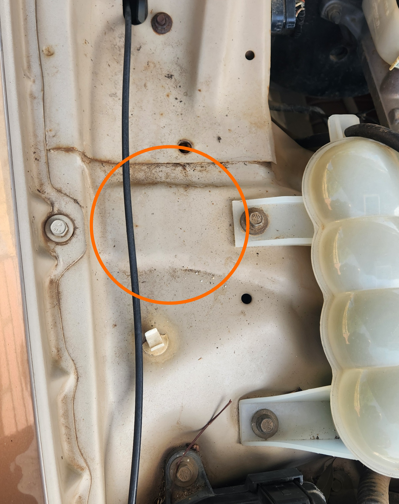
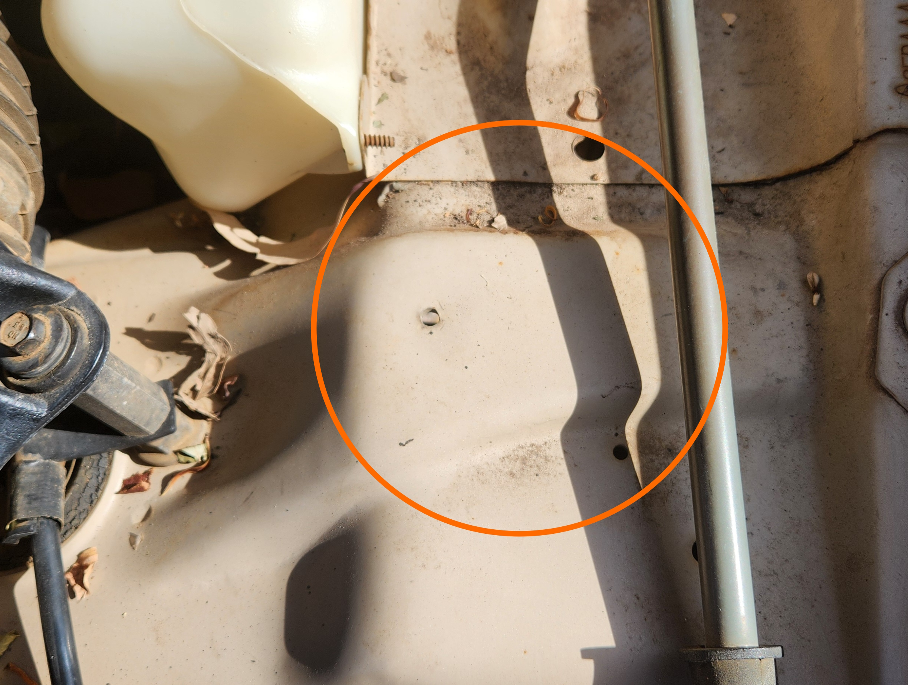

# Reading the Tickford Vehicle Engineering (TVE) Plates

## Important Note

> This page contains all collated information on the TVE plates, but contains no first-hand information on them. This is due to the vehicle used for this project not being fitted with any of the following:
> 
> - [Tickford Modifications](#tickford-vehicle-engineering-plate)
> - [Dual-Fuel LPG](#tickford-dual-fuel-lpg-option-plate)
> - [Tickford-Authorized LPG System](#tickford-authorized-lpg-plate)
> - [A T Series build plate](#tickford-build-number-plate) (as it is not a T-Series trim)
>
> As a result of this, information on this page is considered ***incomplete indefinitely***.
{: .block-note}

## Tickford Vehicle Engineering Plate

Some models of AU Falcon were modified by Tickford in some way. In these cases, an additional plate is riveted to the inside of the hood of the affected models, near the coolant overflow tank.

> Where the TVE plate would be installed if present

### List of Available Modifications

Below is a list of known Tickford-supplied modifications, based on multiple marketing brochures from the period.

> As this information was pulled from multiple sources, accuracy cannot be guaranteed and information is likely incomplete. Every effort has been made to ensure as much accuracy as possible
{: .block-note}

| Modification | Plate Abbreviation | Description / Notes |
| --- | --- | --- |
| 17x8 5 spoke alloy wheels (235/45R17 tires)  | `17" ALLOY WHEELS` | 5 spoke Tickford wheels, generally fitted to XR models. Popular due to simple design |
| Dual-Fuel LPG System | *[Seperate Plate Fitted](#tickford-dual-fuel-lpg-option-plate)* | Only known way to get dual-fuel "from the factory" |
| Body styling kit with front and rear skirts, rocker mouldings and full wing spoiler | `BODYKIT` | Tickford-specific body kit, generally only used on the XR variants |
| Tickford Authorized LPG System | *[Seperate Plate Fitted](#tickford-authorized-lpg-plate)* | |
| Momo steering wheel | `MOMO STEERING WHEEL` | Includes both the colored Leather steering wheels and the wood-accented "Luxury" steering wheel |
| Momo steering wheel and Momo T-Bar shifter | `MOMO STEERING WHEEL & 'T'BAR` | Includes both the colored Leather steering wheels and the wood-accented "Luxury" steering wheel |
| Premium Brakes | `PREMIUM BRAKE PACKAGE` | Approx. 330mm diameter Brembo brake upgrade fitted to Series 2-3 AU Falcons. Different to the brakes fitted to the T-Series models, which have no plate abbreviation due to these models not having the same plate present |
| Sunroof | `SUNROOF` | |

## Alternative Plates

Certain options and configurations had alternative plates, listed below:

### Tickford Build Number Plate

T-Series models of the AU Falcon (TE50/TS50/TL50) did not appear to have Tickford option plates. Instead they were fitted with a Build number plate, which contains a build number vertically on the left side, and a Tickford "Winged T" logo, the Model number (TE50/TS50/TL50) and the VIN Number on the right side. The Tickford build number plate, if present, can be found in the [same location as the TVE Plate](#tickford-vehicle-engineering-plate).

> No image of T-Series Build Number plate or Plate location added as no T-series models included in project

### Tickford Dual-Fuel LPG Option Plate

Another similar-but-different Tickford-issued Options Plate was the Factory Dual-Fuel LPG system. This system is remarkably rare and as such, so is the Option Plate. If fitted, the plate will be present on the passenger side of the engine bay, next to the Air Conditioner line, and should contain the following, in the following approximate layout:

<table style="text-align:left" class="full-width-table">
    <tbody>
        <tr>
            <td colspan="2">
                <a href="../VIN/VIN.md#vehicle-identification-number">V.I.N</a>
            </td>
        </tr>
        <tr>
            <td>
                <a href="../VIN/VIN.md#engine-number">ENGINE No.</a>
            </td>
            <td>
                DATE
            </td>
        </tr>
        <tr>
            <td>
                TANK DATE
            </td>
            <td>
                WATER VOL. XX LITRES
            </td>
        </tr>
        <tr>
            <td colspan="2">
                L.P.G SERIAL No.
            </td>
        </tr>
    </tbody>
</table>

> Where the Tickford Dual-Fuel LPG plate would be installed if present

### Tickford Authorized LPG Plate

LPG system installed by an authorized workshop may have another Tickford branded plate installed, which has Tickford logos on the top, followed by information in the following layout:

<table style="text-align:left" class="full-width-table">
    <tbody>
        <tr>
            <td colspan="2">
                THE LPG SYSTEM COMPLIES WITH ADR44/01 & AS1425-1989
            </td>
        </tr>
        <tr>
            <td colspan="2">
                INSTALLED BY LICENCED WORKSHOP No. 
            </td>
        </tr>
        <tr>
            <td colspan="2">
                <a href="../VIN/VIN.md#vehicle-identification-number">V.I.N</a>
            </td>
        </tr>
        <tr>
            <td>
                <a href="../VIN/VIN.md#engine-number">ENGINE No.</a>
            </td>
            <td>
                DATE
            </td>
        </tr>
        <tr>
            <td colspan="2">
                L.P.G SERIAL No.
            </td>
        </tr>
    </tbody>
</table>