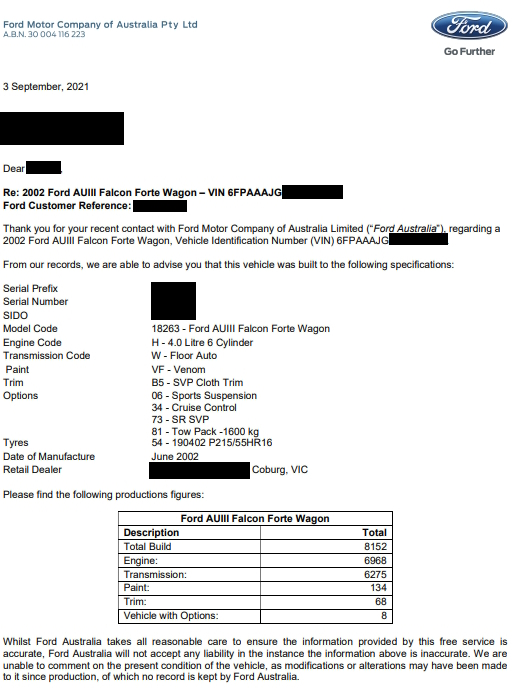

# Verification Letters

If you believe you have a rare trim of Ford Falcon and would like more information on the specifics of how many with the exact same options were made, you can create a ticket with Ford Australia requesting a Vehicle Verification Letter. Note that Ford will likely request any or all of the following information to service your request:

- VIN (required)
- Name
- Email
- Address
- Phone Number

Once your ticket has been processed, you will likely receive a email containing a verification letter in PDF format:

> screenshot of a verification letter request in 2021, with all identifiable information blanked out. Note this is for a AUIII SR Station Wagon, rather than the 1998 Forte used throughout the rest of this project

The important information in this document for most people would be the table at the bottom of the page, which shows the total amount of cars manufactured that match the engine, transmission, paint, trim, and finally vehicle with the exact same options. Note that Ford Australia has no note on how many of the final number of vehicles are actually still on the road, so the chances are your specific model will be a little more rare than the final number.

In order to receive your letter, simply email [foacust1@ford.com](mailto:foacust1@ford.com) with the above information, requesting a verification letter