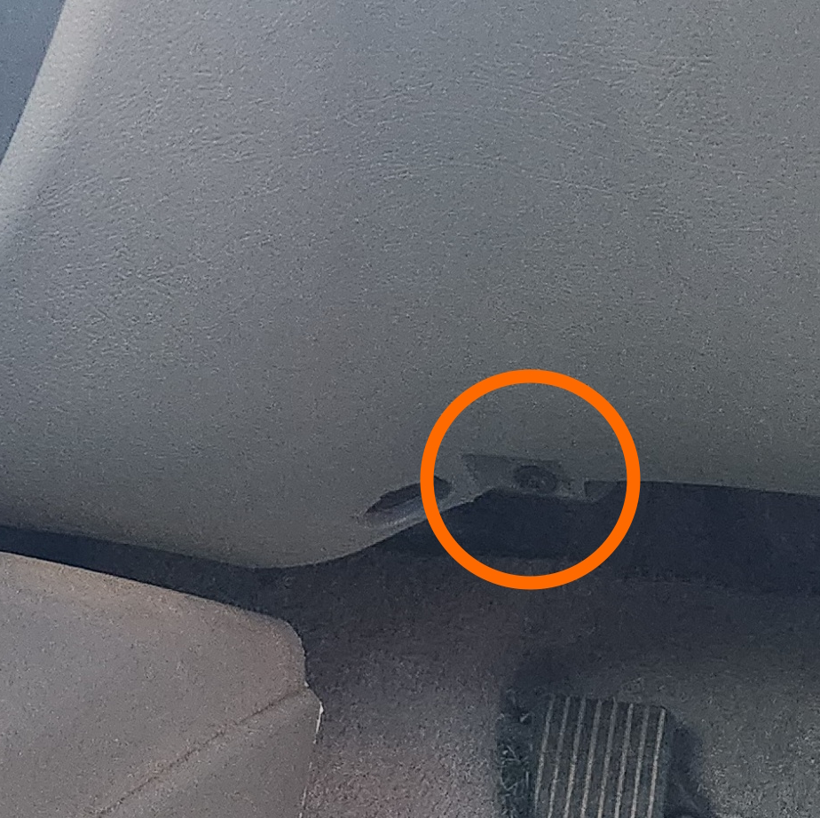

# Body Control Module (BCM)

The BCM of the AU Falcon, sometimes referred to as the BEM or Body Electronics Module, controls many auxiliary functions of the vehicle, including but not limited to:

- Alarm (S2-3 models only)
- Central Locking
  - (S1) [Smartlock](../Keyfob/Keyfob.md#s1-smartlock) **OR**;
  - (1.5-3) [Smartshield](../Keyfob/Keyfob.md#s2s3-smartshield)
- Diagnostic communications (e.g. [DTCs](../DTCCodes/DTCCodes.md))
- Door lock and boot functionality
- Headlight alert
- [Instrument Cluster](../InstrumentCluster/InstrumentCluster.md) communications
- Interior Illumination
- [PCM](../PCM/PCM.md) communications (including immobilizer)
- Power Antenna (where fitted)
- Power Windows (where fitted)
- Rear Demister
- Window wipers

## Location

The BCM can be accessed from the passenger side of the front driver footwell:

> photos of the BCM location, both from the inside of the cabin (driver seat location) and from under the dash (brake pedal location) respectively. Note that despite this model being a Forte, it [contains a high model BCM](#additional-note)

1. ***DISCONNECT THE BATTERY***

    > If possible, the battery should be disconnected for a couple of hours, or overnight, to allow all components to discharge
    {: .block-note}

1. Unscrew the phillips head BCM anchor screw from the bottom section of the driver dash

  

  > Photo of the screw to remove

1. Pull the BCM down gently to access the plugs, and unplug all plugs by pressing in each tab
1. remove the BCM from the dash location
1. done

## Model Variations

There are 2 types of BCM available for the AU Falcon, the Low model and the High model. The high and low BCMs have different configurations depending on the series in which they were installed, making a total of 6 different BCM variations across the model. Thankfully the BCM can be easily identified by colour, using the table below:

<!-- style added as only used here -->

| Series | High/Low | Colour |
| --- | --- | --- |
| 1 | Low | Beige |
| 1 | High | Olive |
| 1.5 | Low | Grey |
| 1.5 | High | Yellow |
| 2-3 | Low | Blue |
| 2-3 | High | Pink |
{: .sortable-table}

> Information Sources:
> - Infomedia Microcat parts catalogue 2013 (temporarily sourced from third-party)
> - Physical inspection (2x S1, 1x S1.5, 1x S3)
{: .info-sources}

### Additional Note

> XR models and Low models with premium features added were fitted with High model BCMs, with functionality only wired in as required for the optioned features. Note that a "premium feature" necessitating a high BCM could be as minor as power windows, coolant level sensors, cruise control or headlight on chimes, however this is unconfirmed. As a general rule of thumb, ***ALWAYS*** check your BCM if you intend on replacing it, so you know what colour to acquire as a replacement.
{: .block-note}