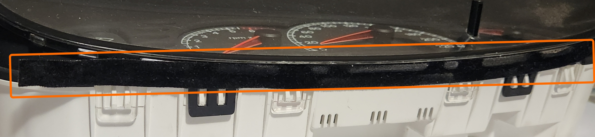
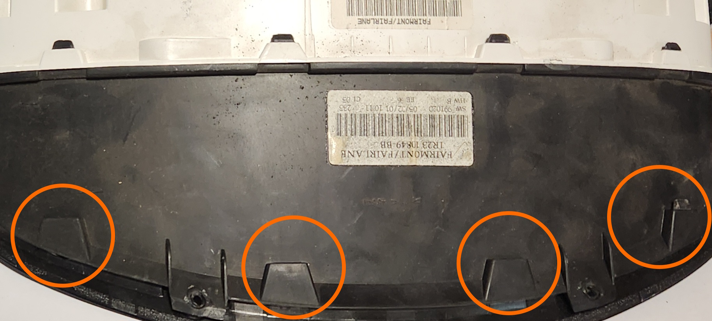
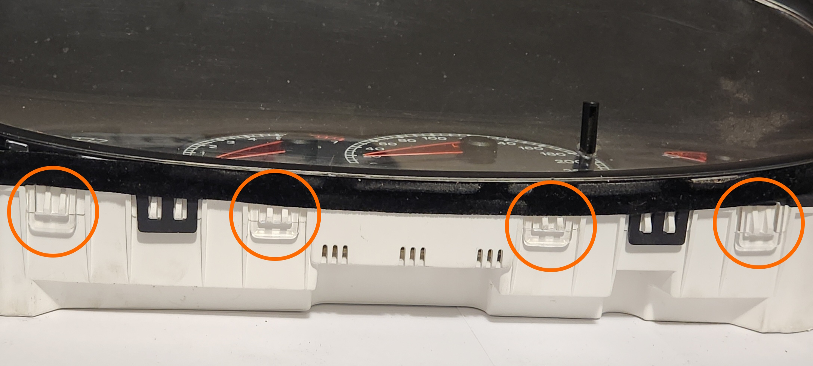
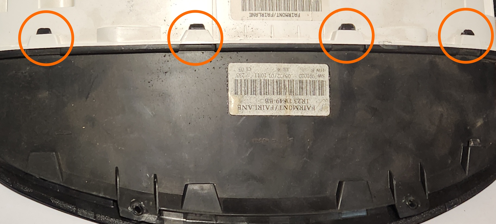
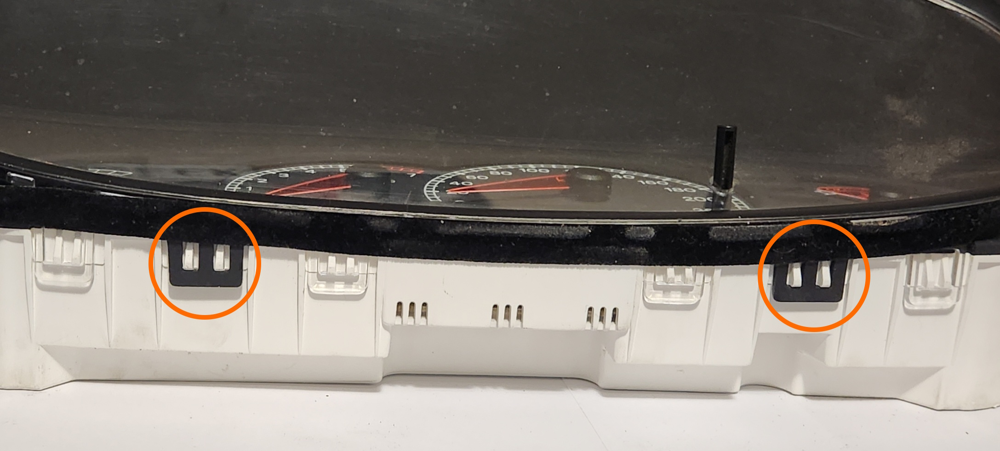
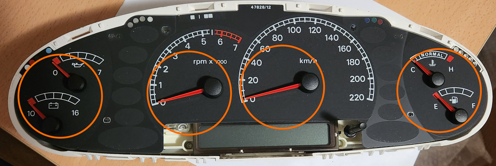
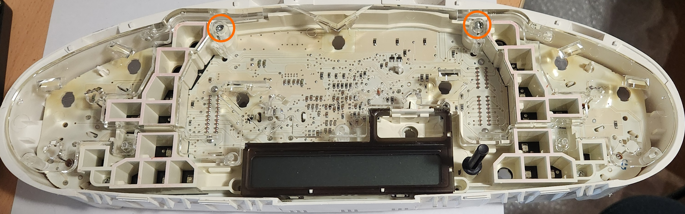
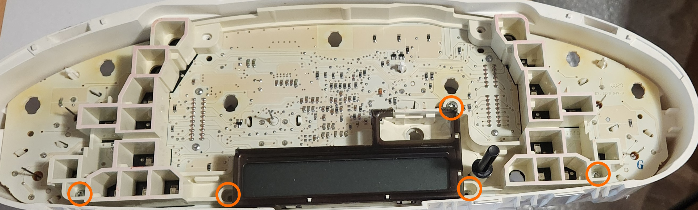
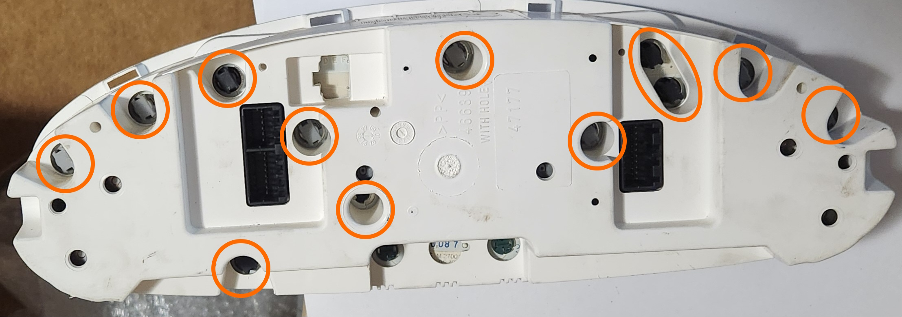

# Disassembling the Instrument Cluster

If required, the instrument cluster can be disassembled using the instructions below, allowing for repairs if required:

> The pictures in these instructions are of a High cluster rather than a base model cluster, as it was determined to be the most "complete" variant. Small variations may apply with a low cluster
{: .block-note}

> For this procedure, it is recommended to use a torx T10, TS10 or T10H screwdriver. a Flat head screwdriver could be used instead but is not recommended as the screws are designed to take Torx screwdrivers

1. (if not already completed) Remove and unplug the Instrument cluster from the vehicle

1. Remove or loosen the fabric tape across the bottom of the cluster to expose the small clear clips along the bottom of the assembly

    

    > A picture of the location of the fabric tape. Once removed, keep this aside for reapplication after repairs are complete

1. Remove the clear cover of the cluster by unclipping the 4 lower and 4 upper clips, ensuring to do the upper clips first

    > Special care must be taken with these clips as they are *very* fragile. Also avoid pulling the plastic from side to side to avoid damaging the cluster button stalk
    {: .block-note}

    
    

    > Pictures of the locations of the top and bottom clear clips in the cluster respectively. Note that on this example, 3 of the 4 upper clips are already broken, highlighting their fragility

1. Remove the black instrument cluster cover by unclipping the 2 lower and 4 upper black plastic clips, ensuring to do the upper clips first again

    > Special care must be taken with the lower clips in particular, as they are *very* fragile. Also avoid pulling the plastic from side to side to avoid damaging the cluster button stalk or the needles for the analogue dials
    {: .block-note}

    
    

    > Pictures of the locations of the top and bottom black plastic clips in the cluster respectively

1. Gently pull the needles for all gauges present on the cluster by pulling up while rotating counter-clockwise

    > It is normal during this step to hear noises from the needles as they break free of the motor behind them
    {: .block-note}

    

    > Picture of the cluster before removal of needles. Note that as this is a higher series cluster, less needles are present on lower models of Falcon

1. Peel the cluster face off of the cluster assembly.

    > While this face is only held in with an adhesive, the clamping force of the black plastic cover provides most of the mounting force, however when placing the face aside, ensure that the adhesive side does not stick to anything else so that reinstallation is easier
    {: .block-note}

1. Remove the 2 upper Torx screws from the assembly, then gently lift the clear plastic diffuser from the cluster

    

    > Picture of the location of the screws to remove prior to lifting the clear plastic from the assembly

1. Remove the remaining 5 Torx screws, and lift the white/cream plastic from the assembly

    > The odometer screen is attached to this piece, be careful when removing as it is pressed onto the board using elastomeric connectors, and so it will feel as if it is "peeling" off around that area
    {: .block-note}

    

    > Picture of the location of the final screws to be removed before lifting the white plastic from the assembly

1. Rotate assembly so that the back is facing you, and remove all bulbs from the back of the board

    

    > Picture of the locations of the bulbs in the back of the cluster. note that the locations of these bulbs may be different depending on the cluster variation, and that removal of the odometer backlight bulbs is ***NOT*** required

1. Finally, gently lift the board from the assembly

1. Done