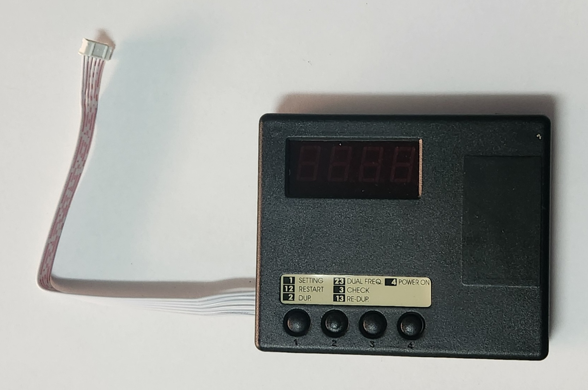
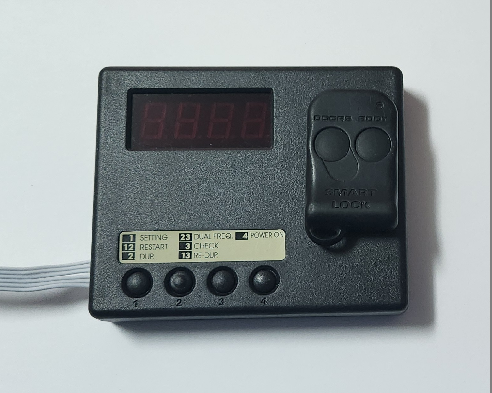
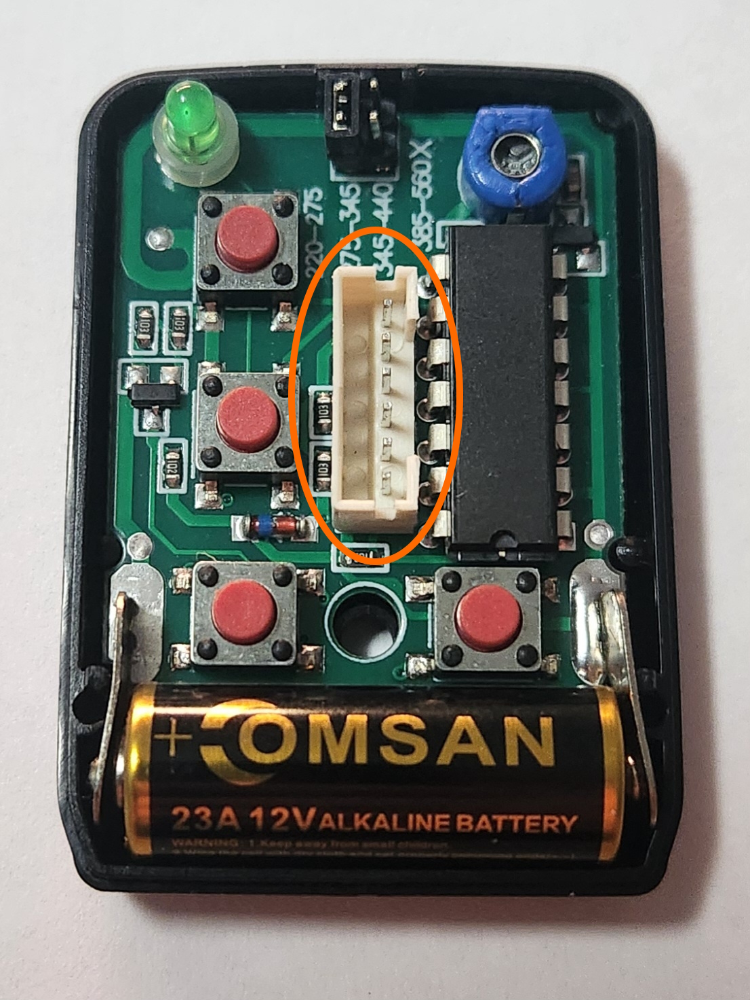
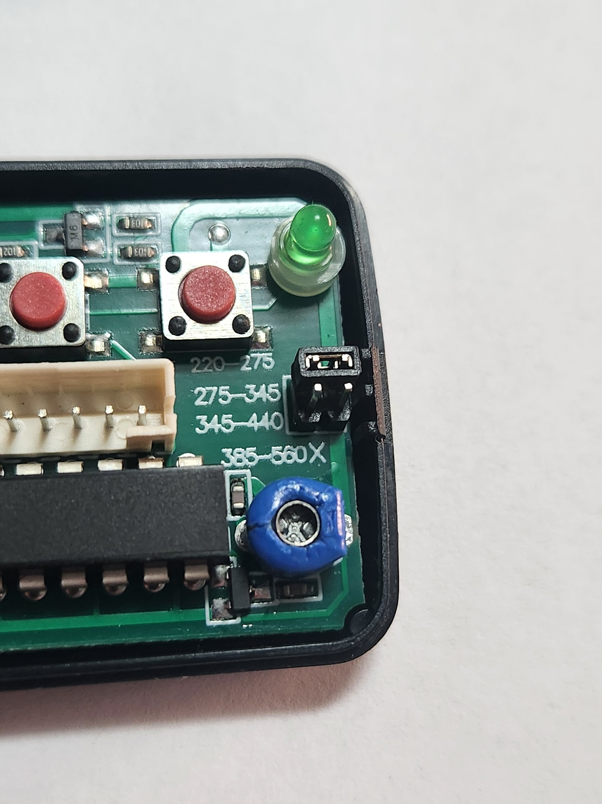
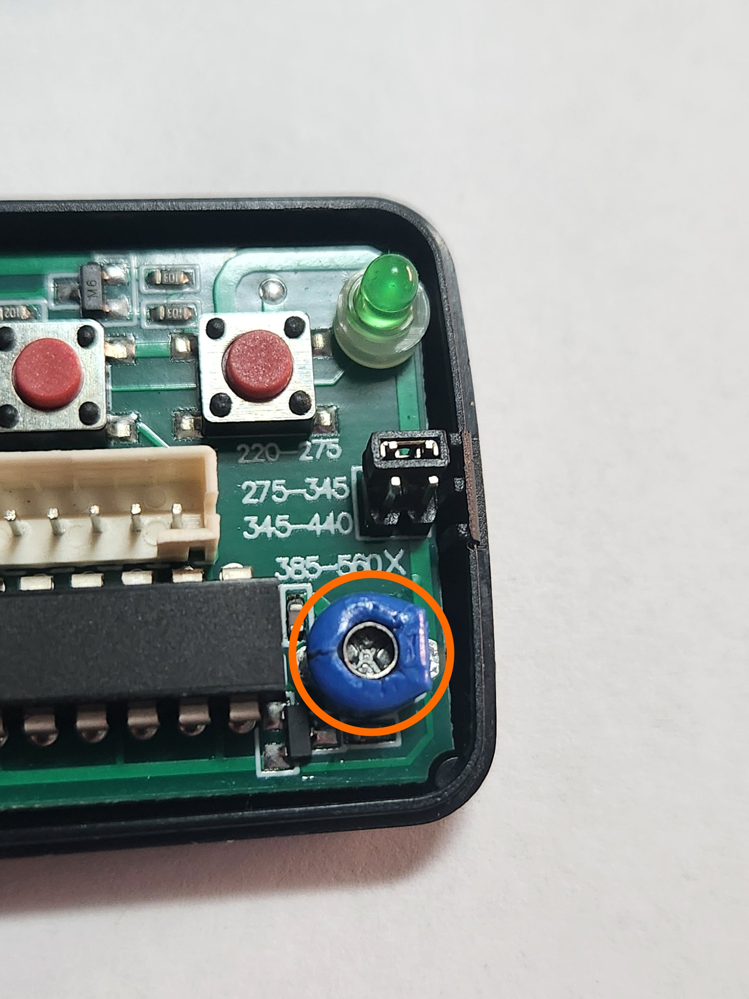

# Manufacturer Specific Instructions - Remocon

## CAVEATS
- Requires a OEM remote to clone. Cannot be someone elses remote as the cloned remote would then operate both cars
- The Remocon RMC-600, which advertises the ability to copy codes without the use of a programmer was tested to ***NOT*** work when trying to copy an OEM [Series 1](../../../Miscellaneous/SeriesInformation/SeriesInformation.md#series-1) remote. It does work with already copied RMC-555 remotes, but this may present a signal degradation issue in making copy-of-copy remotes, and makes the ability to copy without the RMC-888 a moot point.
- The Remocon RMC-888 appears to have poor quality control and can arrive with issues such as jammed or stuck buttons and faulty wiring causing certain functions to be ineffective

## What you need
- A Remocon RMC-555 Remote. This can be found primarily on online marketplaces such as [AliExpress](../../../Credits.md#sources)

    
    

    > Photos of the casing and board of a Remocon RMC-555 programmable keyfob. Device provided by [AliExpress](../../../Credits.md#sources)

- A Remocon RMC-888 Programmer device. This can also be found primarily on online marketplaces such as [AliExpress](../../../Credits.md#sources)

    

    > Photo of a RMC-888 programmer

    > Photo shown has removable cable, however shown with cable plugged in due to cable fitment issues requiring disassembly to fit for demonstration (low Quality Control)
    {: .block-note}

- (optional) 12V (1A min.) DC Power Supply (5.5mm*2.5mm barrel connector)

    > This is only required if the ordered RMC-888 device comes with another country's power supply plug (likely if imported from overseas)
    {: .block-note}

## Instructions (Series 1 Smartlock remote)

1. Press and hold buttons 2 and 3 to enter into dual frequency programming mode. The display should show `r111`

    > In theory this can also be achieved by pressing button 1 to go into single frequency setting, however the tested unit was unable to achieve this due to [poor quality control](#caveats)
    {: .block-note}

1. Hold the OEM remote to the programming area on the RMC-888 and press and hold the button you would like programmed to button 1 until the display reads `done`. After this the display will show a code such as `b-10`, however this is not particularly important, as this simply denotes the type of Remocon remote that can be used with the copied code

    

    > Place OEM remote as shown

1. The display should now read `r112` to signify the next button to be added to the configuration. continue adding buttons using the above method for up to 5 buttons, then press button 1 to skip through programming of other buttons

    > Process tested programming to the following:
    > - `r111` lock/unlock button
    > - `r112` boot button
    > - `r113` lock/unlock button
    > - `r114` boot button
    > - `r115` (skipped)
    > - `r221` (skipped)
    > - `r222` (skipped)
    > - `r223` (skipped)
    > - `r224` (skipped)
    > - `r225` (skipped)
    {: .block-note}

1. After completing the segment reading `r225` either by skipping or programming, the display should read `0.0`, signifying that the programmer is back to the "main menu"
1. Ensure the frequency jumper is in the correct position to send 275-345mHz signals, and then plug the RMC-555 remote into the programmer using the small 6-pin ribbon cable on the RMC-888 programmer device.

    

    > Location of the plug where you should connect the 6 pin ribbon cable

    

    > Photo of the position that the frequency jumper should be in on the RMC-555 remote

1. Press button 2 to duplicate the current configuration to the attached keyfob. the display should read `Pb10`
1. Once you are back at the home menu, test the fobs by comparing the frequency of the new keyfob vs the original OEM one. Use the frequency adjuster screw to make minute adjustments to the frequency until the both match as closely as possible.

    

    > Turn this screw to make small adjustments to the frequency of the remote. Recommended margin of error is ±0.5mHz

    > The Check function of the RMC-888, accessible using button 3, is helpful for fine tuning for the remote
    {: .block-note}

1. Done