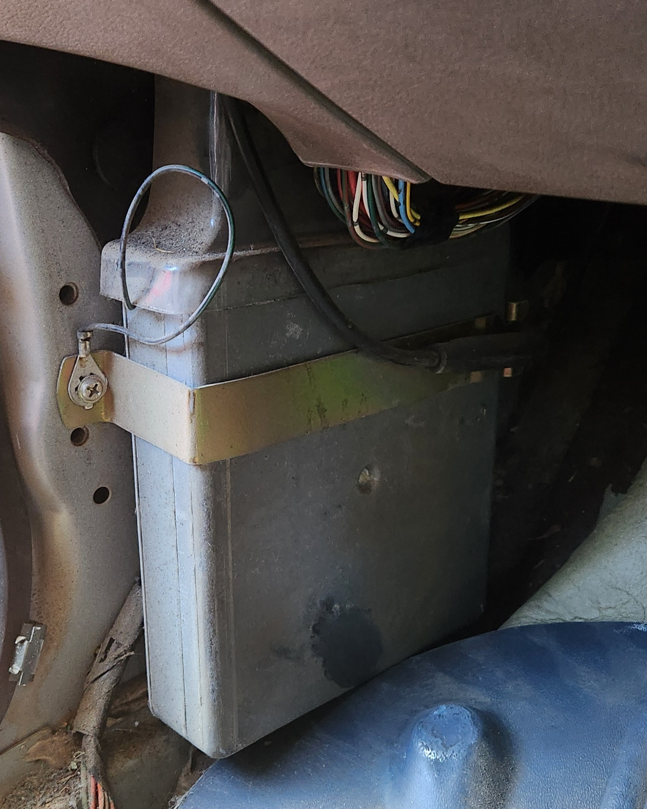

# PCM

The PCM, or Powertrain Control Module, can be seen as the brains of the AU Falcon's Engine/Transmission management system

## Location

If you ever need access to the PCM in your AU Falcon, it can be found either bolted or riveted to the very bottom of the A Pillar area of the passenger side of the cabin. This can be useful if you intend on adding a performance chip (such as a J3 chip from [T.I. Performance](../../Credits.md#sources))

> Later models of AU Falcon PCMs are secured using large rivets, which will need to be drilled out or grinded off. When reinstalling, new rivets or tek screws are commonly used viable replacements.
{: .block-note}

> Location of the PCM on a [Series 1](../../Miscellaneous/SeriesInformation/SeriesInformation.md#series-1) AU Falcon. Note that Series 2-3 brackets are larger and are riveted in for security

## Additional Notes

- PCMs can be identified by catch code with a moderate level of accuracy, more information can be found on the [Catch Codes Page](./CatchCodes/CatchCodes.md)