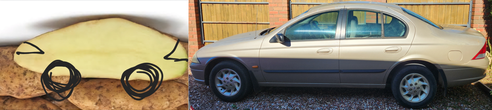

<h1 style="display:none;">Home</h1>

A collation of notes and information about the AU Series Ford Falcon, collated while working on a Falcon Forte, nicknamed "SPUD".

> The information here is *most* accurate for the MY 1999 S1 Ford Falcon Forte Sedan, but as much information as possible has been added for other variants
{: .block-note}

{: .narrow-image}

> "artists" rendition of car (left) and photo of car (right)

---

> This is an information preservation project, made as well as possible using very limited resources
> 
> This ***IS NOT*** meant to be the AU Falcon Bible *or* a workshop manual, but rather a last resort to get information that has started to disappear from, or worse, never existed on, the wider internet.
> 
> In the spirit of not having this site reliant on other websites, there are as few links to the wider internet here as possible, other that those present on the [Credits](./Credits.md) page (also linked at the bottom of every page on this site).

***ALL INFORMATION IS WIP, LAST UPDATE: {{site.time | date: '%d/%m/%Y'}}***

